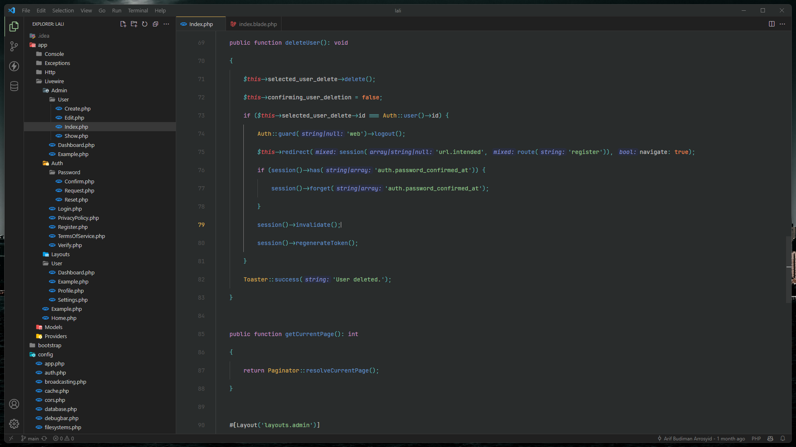
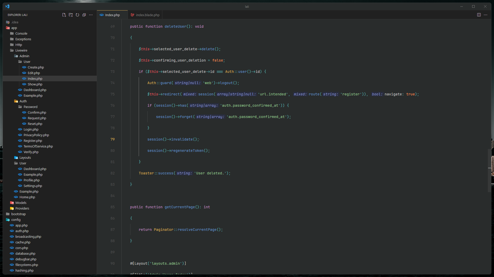
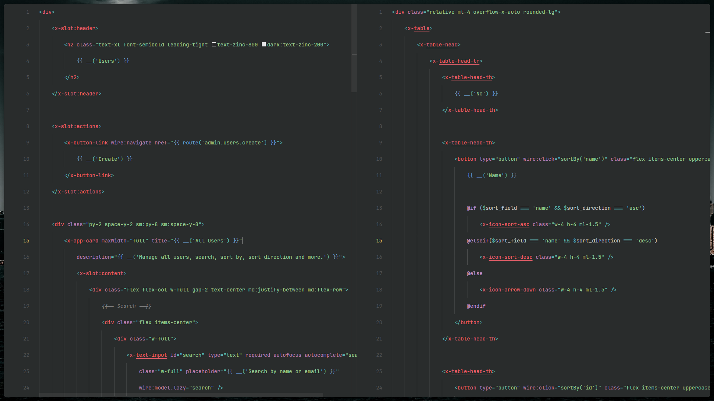
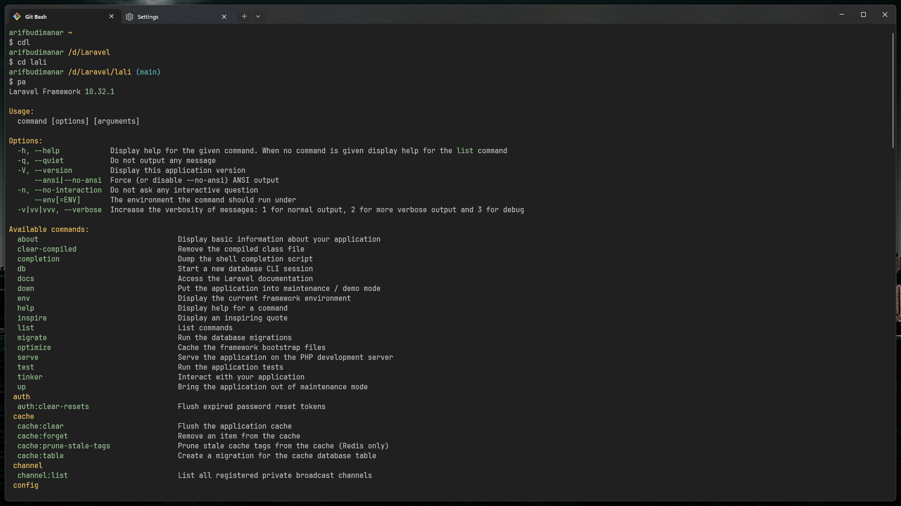

# ArifCode Theme - Windows
Oceanic dark theme for VS Code and Windows Terminal.

## Installation
### With Git Clone
1. Clone this repository
```bash
git clone https://github.com/arifbudimanar/arifcode-theme-windows
```

2. Install VSCE
```bash
npm install -g vsce
```

3. Build the extension
```bash
npm run build
```

4. Package the extension
```bash
vsce package
```

5. Install the extension

```bash
code --install-extension generated-filename.vsix
```
### With VSIX
1. Download the latest [release](https://github.com/arifbudimanar/arifcode-theme-windows/releases)
2. Install the extension
```bash
code --install-extension generated-filename.vsix
```
### With [VSCode](https://marketplace.visualstudio.com/items?itemName=arifbudimanar.arifcode-theme-windows)
1. Open the Extensions sidebar in VS Code
2. Search for `ArifCode Theme`
3. Click `Install`

## Preview
### Default

### Minimalist

### Zen Mode


## File
### HTML/CSS

### PHP


## Recommended Settings
### settings.json
```json
{
	"breadcrumbs.enabled": false,
	"editor.bracketPairColorization.enabled": false,
	"editor.cursorBlinking": "phase",
	"editor.cursorSmoothCaretAnimation": "on",
	"editor.fontFamily": "'JetBrains Mono'",
	"editor.fontLigatures": true,
	"editor.formatOnSave": true,
	"editor.inlineSuggest.enabled": true,
	"editor.lineHeight": 3.15,
	"editor.matchBrackets": "never",
	"editor.minimap.enabled": false,
	"editor.renderLineHighlight": "none",
	"editor.renderWhitespace": "none",
	"editor.smoothScrolling": true,
	"explorer.compactFolders": false,
	"explorer.confirmDelete": false,
	"explorer.confirmDragAndDrop": false,
	"files.autoSave": "onWindowChange",
	"material-icon-theme.activeIconPack": "angular",
	"material-icon-theme.folders.color": "#808080",
	"material-icon-theme.folders.theme": "specific",
	"material-icon-theme.hidesExplorerArrows": true,
	"scm.diffDecorations": "gutter",
	"screencastMode.fontSize": 30,
	"screencastMode.keyboardOverlayTimeout": 5000,
	"screencastMode.verticalOffset": 2,
	"security.workspace.trust.untrustedFiles": "open",
	"telemetry.telemetryLevel": "off",
	"terminal.explorerKind": "external",
	"terminal.integrated.cursorBlinking": true,
	"terminal.integrated.cursorStyle": "line",
	"terminal.integrated.defaultProfile.windows": "Git Bash",
	"terminal.integrated.enableMultiLinePasteWarning": false,
	"terminal.integrated.fontFamily": "JetBrainsMono Nerd Font",
	"terminal.integrated.gpuAcceleration": "on",
	"typescript.inlayHints.enumMemberValues.enabled": true,
	"window.autoDetectColorScheme": true,
	"window.commandCenter": false,
	"window.menuBarVisibility": "compact",
	"window.title": "${rootName}",
	"workbench.activityBar.location": "hidden",
	"workbench.colorTheme": "ArifCode Theme",
	"workbench.iconTheme": "material-icon-theme",
	"workbench.layoutControl.enabled": false,
	"workbench.list.smoothScrolling": true,
	"workbench.preferredDarkColorTheme": "ArifCode Theme",
	"workbench.preferredLightColorTheme": "GitHub Light Default",
	"workbench.startupEditor": "none",
	"workbench.statusBar.visible": false,
	"workbench.tree.indent": 16,
	"zenMode.centerLayout": false,
	"zenMode.fullScreen": false,
	"zenMode.hideLineNumbers": false
}
```

### keybindings.json
```json
[
    {
        "key": "alt+b",
        "command": "workbench.action.toggleActivityBarVisibility"
    },
    {
        "key": "alt+m",
        "command": "workbench.action.toggleMenuBar"
    },
    {
        "key": "alt+n",
        "command": "workbench.action.toggleStatusbarVisibility"
    }
]
```

## Windows Terminal

### settings.json
```json
{
	"background": "#202020",
	"black": "#292c2c",
	"blue": "#6699CC",
	"brightBlack": "#c6c6c6",
	"brightBlue": "#6699CC",
	"brightCyan": "#56B6C2",
	"brightGreen": "#99C794",
	"brightPurple": "#C594C5",
	"brightRed": "#FAC863",
	"brightWhite": "#c6c6c6",
	"brightYellow": "#FAC863",
	"cursorColor": "#c6c6c6",
	"cyan": "#5FB3B3",
	"foreground": "#c6c6c6",
	"green": "#99C794",
	"name": "ArifCode Windows",
	"purple": "#C594C5",
	"red": "#E15A60",
	"selectionBackground": "#c6c6c6",
	"white": "#c6c6c6",
	"yellow": "#FAC863"
}

```