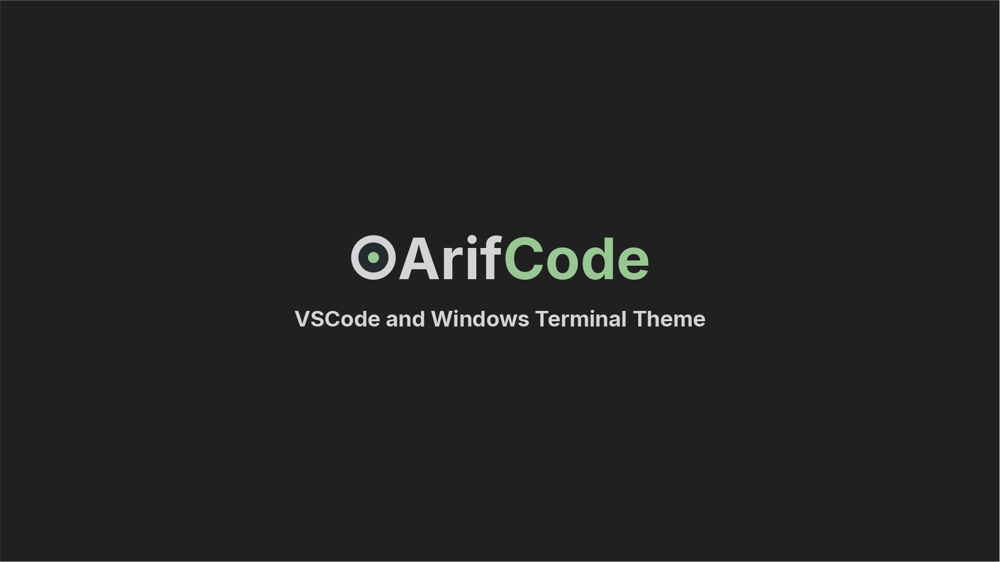
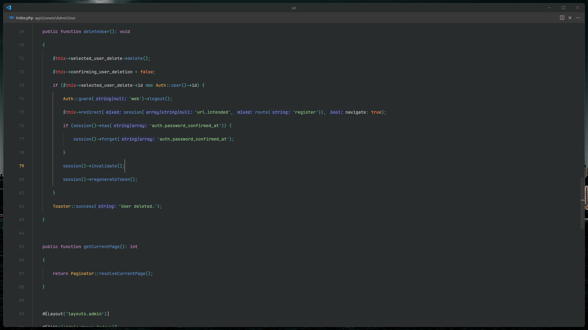
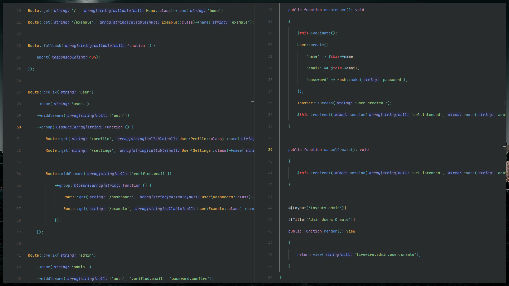

# ArifCode Theme - Windows
Oceanic dark theme for VS Code and Windows Terminal.

## Installation
```
ext install arifbudimanar.arifcode-theme-windows
```

## Preview
### Default

### Minimalist

### Zen Mode

## Recommended Settings
### settings.json
```json
{
	"breadcrumbs.enabled": false,
	"diffEditor.ignoreTrimWhitespace": false,
	"editor.bracketPairColorization.enabled": false,
	"editor.cursorBlinking": "expand",
	"editor.cursorSmoothCaretAnimation": "on",
	"editor.cursorStyle": "line-thin",
	"editor.fontFamily": "'JetBrains Mono'",
	"editor.fontLigatures": true,
	"editor.formatOnSave": true,
	"editor.inlineSuggest.enabled": true,
	"editor.lineHeight": 3.15,
	// "editor.lineHeight": 2.15,
	// "editor.lineHeight": 48,
	"editor.matchBrackets": "never",
	"editor.minimap.enabled": false,
	"editor.renderLineHighlight": "none",
	"editor.renderWhitespace": "none",
	"editor.smoothScrolling": true,
	"explorer.compactFolders": false,
	"explorer.confirmDelete": false,
	"explorer.confirmDragAndDrop": false,
	"files.autoSave": "onWindowChange",
	"material-icon-theme.activeIconPack": "angular",
	"material-icon-theme.folders.color": "#808080",
	"material-icon-theme.folders.theme": "specific",
	"material-icon-theme.hidesExplorerArrows": true,
	"scm.diffDecorations": "gutter",
	"screencastMode.fontSize": 30,
	"screencastMode.keyboardOverlayTimeout": 5000,
	"screencastMode.verticalOffset": 2,
	"security.workspace.trust.untrustedFiles": "open",
	"telemetry.telemetryLevel": "off",
	"terminal.explorerKind": "external",
	"terminal.integrated.cursorBlinking": true,
	"terminal.integrated.cursorStyle": "line",
	"terminal.integrated.defaultProfile.windows": "Git Bash",
	"terminal.integrated.enableMultiLinePasteWarning": false,
	"terminal.integrated.fontFamily": "JetBrainsMono Nerd Font",
	"terminal.integrated.gpuAcceleration": "on",
	"typescript.inlayHints.enumMemberValues.enabled": true,
	"update.mode": "default",
	"window.autoDetectColorScheme": true,
	"window.commandCenter": false,
	"window.title": "${rootName}",
	"workbench.colorTheme": "ArifCode Theme - Windows",
	"workbench.editor.tabCloseButton": "off",
	"workbench.iconTheme": "material-icon-theme",
	"workbench.layoutControl.enabled": false,
	"workbench.list.smoothScrolling": true,
	"workbench.preferredDarkColorTheme": "ArifCode Theme - Windows",
	"workbench.preferredLightColorTheme": "GitHub Light Default",
	"workbench.startupEditor": "none",
	"workbench.tree.indent": 16,
	"zenMode.centerLayout": false,
	"zenMode.fullScreen": false,
	"zenMode.hideLineNumbers": false,
	"workbench.activityBar.location": "hidden",
	"workbench.statusBar.visible": false,
	"window.menuBarVisibility": "compact"
}
```

## Want more minimalist? I got you!
Install `Apc Customize UI++` and add this to config
```
"window.titleBarStyle": "native",
"apc.electron": {
	"frame": false,
},
"apc.activityBar": {
	"size": 36,
},
"apc.menubar.compact": true,
"apc.statusBar": {
	"height": 30,
},
```
### Without Frame 

## Even more?
```
"zenMode.showTabs": "none",
```
### Without Frame + Zen Mode + No Tab


## File
### HTML/CSS

### PHP


### keybindings.json
```json
[
    {
        "key": "alt+b",
        "command": "workbench.action.toggleActivityBarVisibility"
    },
    {
        "key": "alt+m",
        "command": "workbench.action.toggleMenuBar"
    },
    {
        "key": "alt+n",
        "command": "workbench.action.toggleStatusbarVisibility"
    }
]
```

## Windows Terminal

### settings.json
```json
{
	"background": "#202020",
	"black": "#292C2C",
	"blue": "#6699CC",
	"brightBlack": "#C6C6C6",
	"brightBlue": "#6699CC",
	"brightCyan": "#56B6C2",
	"brightGreen": "#99C794",
	"brightPurple": "#C594C5",
	"brightRed": "#FAC863",
	"brightWhite": "#C6C6C6",
	"brightYellow": "#FAC863",
	"cursorColor": "#C6C6C6",
	"cyan": "#5FB3B3",
	"foreground": "#C6C6C6",
	"green": "#99C794",
	"name": "ArifCode Windows",
	"purple": "#C594C5",
	"red": "#E15A60",
	"selectionBackground": "#C6C6C6",
	"white": "#C6C6C6",
	"yellow": "#FAC863"
}
```
